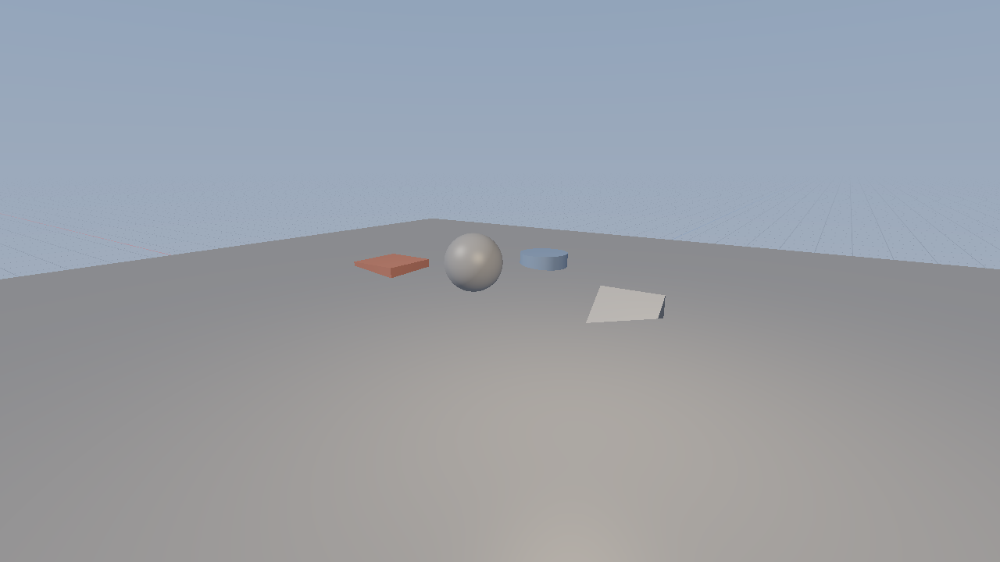
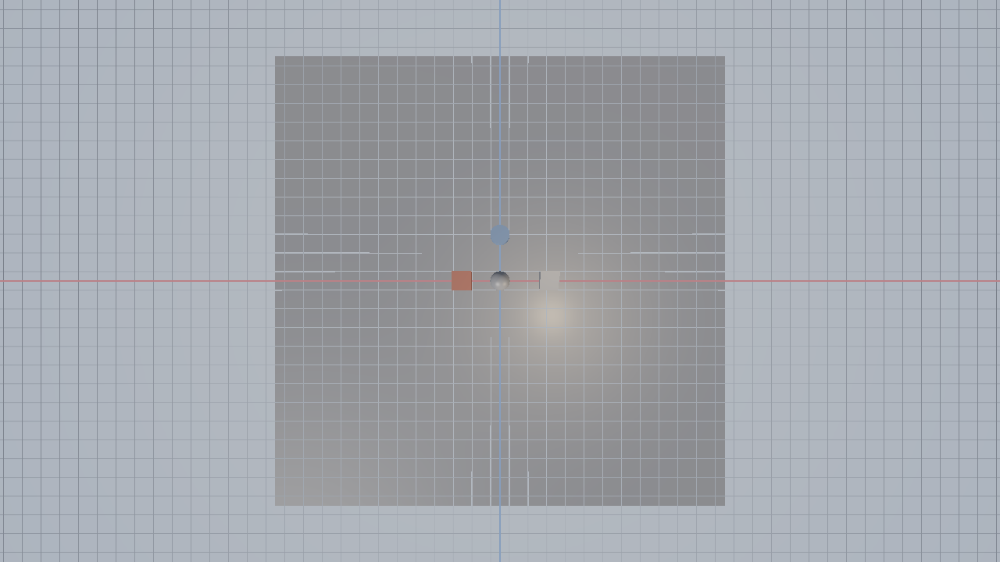

# Forgeworks Engine

A from-scratch, script-driven 3D game engine for **Windows**, built in C++17 with **DirectX 11**,
**Jolt Physics**, **Lua** scripting (via sol2), **miniaudio**, and a Godot/Hammer-hybrid map editor.

This is a real engine, not a demo: the runtime loads scenes, meshes, materials and **Lua scripts**
from disk and executes them every frame. Nothing about gameplay is hard-coded into the executable —
if you don't write a script for an entity, it just sits there. Attach a `.lua` script to any entity
(whether it's a normal mesh entity or a Hammer-style brush) and the engine will call into it every
frame, exactly like Godot/Unity/Source do.

## Screenshots

The editor's viewport renders the default starter scene the moment it opens - camera,
sun, sky, ground and a few primitives you can immediately grab with the gizmo:





These images are produced by the engine itself: `fwshot` renders any `.fwscene` with the
CPU reference renderer (`engine/render/SoftwareRenderer.h`), which mirrors the D3D11
renderer's camera math and passes. It needs no GPU, so screenshots can be generated on
any machine, in CI, or from a headless build:

```bash
# whole scene, using the scene's own Main Camera
./build-headless/bin/fwshot assets/scenes/default.fwscene docs/screenshots/viewport.png
# other viewpoints / options
./build-headless/bin/fwshot assets/scenes/default.fwscene top.png --camera top
./build-headless/bin/fwshot assets/scenes/default.fwscene wire.png --wireframe --no-grid
```

If you want a picture of the *whole editor window* (all ImGui panels included), the
editor can do that too - this runs on Windows and does not need anyone at the keyboard:

```powershell
build\bin\ForgeworksEditor.exe --screenshot shots\editor.png --frames 30
# -> shots\editor.png            (full window, GPU rendered)
# -> shots\editor.png.viewport.png (3D viewport only, CPU rendered)
```

The game runtime accepts the same switches (`ForgeworksGame.exe --screenshot ... --play`).

## Feature overview

- **Renderer**: Forward D3D11 renderer, dynamic lights (directional/point/spot) with shadow maps,
  **baked lightmaps** (CPU hemisphere-sampling lightmap baker) blended with real-time lighting,
  PBR-ish material model (albedo/normal/metallic-roughness/emissive/AO), skybox, post-process
  (tonemap/gamma/FXAA-lite/bloom).
- **Physics**: [Jolt Physics](https://github.com/jrouwe/JoltPhysics) — rigid bodies, static
  collision from brush/mesh geometry, character controller, raycasts/sweeps, triggers, all
  exposed to Lua.
- **Audio**: miniaudio-based 3D positional audio engine (WASAPI on Windows), music/SFX buses,
  volume/pitch, occlusion-ready.
- **Scripting**: Lua 5.5 + sol2 bindings. Scripts implement `OnStart`, `OnUpdate(dt)`,
  `OnFixedUpdate(dt)`, `OnCollisionEnter`, `OnTriggerEnter`, input callbacks, etc. The engine is
  driven by these callbacks — this *is* the gameplay layer.
- **ECS**: sparse-set Entity/Component/System core (Transform, MeshRenderer, Light, RigidBody,
  Collider, ScriptComponent, AudioSource, Camera, BrushComponent, ...), scene graph with parenting.
- **Asset pipeline**: OBJ (tinyobjloader) + a native `.fwmesh` binary mesh format, PNG/JPG textures
  (stb_image), material `.json` files, `.lua` scripts, `.fwscene` scene files (JSON), a simple
  in-editor asset browser.
- **Map Maker (editor)**: ImGui + ImGuizmo based editor —
  - **Godot-style mode**: 3D viewport w/ gizmos, scene hierarchy, inspector (component editing),
    asset browser, script text editor with live reload, play/stop/pause with in-editor simulation.
  - **Hammer mode** (toggle button): classic brush-based level design — box/cylinder/CSG brushes,
    face-based texture/UV editing, the **Clipping tool**, vertex manipulation, brushes carved with
    boolean subtract, and brushes automatically convert to render meshes + physics collision.
    Brushes (and "entity" brushes, like Hammer's point entities) can have Lua scripts attached and
    behave exactly like any other engine entity — Hammer mode is a geometry authoring mode for the
    *same* engine and scene format, not a separate game.
  - Lightmap baking button (bakes static geometry lighting to lightmaps stored alongside the scene).
- **Game shell**: Main Menu, Settings menu (video/audio/controls, saved to `settings.json`),
  pause menu, and a `game.exe` runtime that just loads a `.fwscene` and runs it — no editor code
  compiled in.

## Repository layout

```
engine/            Core engine library (Forgeworks) - platform, math, ecs, render, physics,
                    audio, scripting, assets, brush/CSG, lightmapping.
  include/engine/   Public headers
  src/              Implementation
editor/             The Map Maker (Godot-like editor + Hammer mode), built on top of engine/.
game/               Thin runtime executable: game.exe, loads main menu + a scene and plays it.
assets/             Sample game content: scenes, scripts, textures, models, sounds, shaders.
third_party/        Vendored dependencies (see Third-Party Libraries below).
cmake/              Helper CMake modules.
tools/              Build tools (fwshot: scene -> PNG screenshot renderer).
docs/               Extra documentation (scripting API reference, file formats, build notes)
                    incl. docs/screenshots/.
```

## Building (Windows, Visual Studio 2026)

This project targets **Windows + DirectX 11** using MSVC. It will NOT build a graphical target on
Linux/macOS (there is no D3D11 there) — see "Headless / CI build" below for what *does* build
cross-platform (used to validate engine logic in this repo's automated checks).

Prerequisites:
- Visual Studio 2026 (Desktop C++ workload) or the standalone MSVC Build Tools
- CMake ≥ 4.2 (needed for the `Visual Studio 18 2026` generator name; VS 2026 bundles a recent-enough CMake automatically)
- Windows 10/11 SDK (installed with VS)

```powershell
git clone <this repo>
cd 3d-game-engine
cmake -S . -B build -G "Visual Studio 18 2026" -A x64
cmake --build build --config RelWithDebInfo
```

Outputs:
- `build/editor/RelWithDebInfo/ForgeworksEditor.exe` — the Map Maker
- `build/game/RelWithDebInfo/ForgeworksGame.exe` — the standalone game runtime

Run the editor, open/create a scene under `assets/scenes`, and press **Play** to test with real
physics/scripts/audio running in-editor. Use the **Hammer Mode** button in the toolbar to switch
the viewport into brush editing.

### What you should see on first launch

The editor opens `assets/scenes/default.fwscene`. If that file does not exist yet (fresh
clone), it is generated - together with `assets/materials/*.fwmat`, `assets/scripts/spin.lua`
and the dev texture `assets/textures/dev/dev_grey.png` - so the map maker never starts on an
empty void. The starter scene contains a directional sun, a sky light, a 20x20m ground, a
dynamic box/sphere, a cylinder, a ramp, a point light and a `Main Camera`, plus a matching
ground brush for Hammer mode.

The viewport shows the scene, a ground grid (red X axis, blue Z axis) and an info overlay:
renderer mode, camera position/speed, entity count and the current mouse position. The dock
layout (Hierarchy / Viewport / Inspector / Assets / Console) is built automatically the first
time the editor runs.

Viewport controls: **RMB drag** looks, **WASD/QE** move (no button needed), **Shift** = fast,
**mouse wheel** = fly speed, **F** = frame the selection, **F12** = save a viewport PNG to
`assets/screenshots/viewport.png`.

### If the 3D viewport is ever blank

1. Look at the **Console** panel - a missing/failed HLSL shader, a missing scene file or a
   failed render-target creation all log an explicit error there.
2. Enable **View > Viewport Info Overlay**: the top-left line names the active renderer and
   says whether the grid/wireframe are on, so an "empty" viewport is immediately explained.
3. Switch to **View > CPU Viewport Preview**. This renders the same scene with the CPU
   reference renderer, which needs no GPU at all. If the CPU preview shows geometry but the
   GPU view is blank, the problem is in the D3D11 path (shaders/device); if *both* are blank,
   the camera is probably pointing somewhere empty - press **F** to frame the selection or
   **View > Reset Camera**.
4. The editor switches to the CPU preview automatically (and says so in the Console) when the
   render target or the mesh shader is unavailable, so a broken GPU path degrades to "slower
   but visible" instead of "blank".

Content paths are resolved against the project root (the folder containing `assets/`), which
is auto-detected from the executable location, the working directory or the
`FORGEWORKS_ROOT` environment variable - so launching `build\bin\ForgeworksEditor.exe` by
double-clicking it finds its assets too. Both executables also accept `--root <dir>` and
`--help`.

If you are still on Visual Studio 2022, swap the generator back to `-G "Visual Studio 17 2022"`. That still works; no other project changes are needed (`cmake_minimum_required` in `CMakeLists.txt` remains 3.20).

## Headless / CI build (Linux, used for validating engine logic)

Passing `-DFORGEWORKS_HEADLESS=ON` builds only the platform-independent parts of `engine/`
(ECS, math, scripting, physics, brush/CSG, scene I/O) plus a `engine_tests` target with no
D3D11/Win32/audio dependency, so the core simulation logic can be compiled and unit-tested on any
platform. This is how the logic in this repository is validated without a Windows machine; it is
**not** the shipping game.

```bash
cmake -S . -B build-headless -DFORGEWORKS_HEADLESS=ON
cmake --build build-headless -j
./build-headless/bin/engine_tests          # unit/smoke tests
./build-headless/bin/fwshot assets/scenes/default.fwscene out.png
```

`engine_tests` also covers the rendering-visible behaviour: camera/projection convention,
primitive winding (backface correctness) and a "the viewport is not blank" test that renders
the starter scene with the CPU reference renderer, asserts real geometry is covered, and
writes `test_output/viewport.png` for eyeballing.

## Scripting API

See [`docs/scripting.md`](docs/scripting.md) for the full Lua API (entity/transform access,
physics queries, input, audio, timers, spawning, events).

## File formats

See [`docs/file_formats.md`](docs/file_formats.md) for `.fwscene`, `.fwmesh`, `.fwmat`, and the
Hammer-mode `.fwmap` brush format.

## Third-party libraries (vendored under `third_party/`)

| Library | Purpose | License |
|---|---|---|
| [Jolt Physics](https://github.com/jrouwe/JoltPhysics) | Rigid body / collision physics | MIT |
| [Lua](https://www.lua.org/) | Embedded scripting language | MIT |
| [sol2](https://github.com/ThePhD/sol2) | Lua ↔ C++ binding | MIT |
| [Dear ImGui](https://github.com/ocornut/imgui) | Editor UI | MIT |
| [ImGuizmo](https://github.com/CedricGuillemet/ImGuizmo) | 3D transform gizmos | MIT |
| [GLM](https://github.com/g-truc/glm) | Math library | MIT |
| [miniaudio](https://github.com/mackron/miniaudio) | Audio playback | MIT-0 |
| [stb_image / stb_image_write](https://github.com/nothings/stb) | Image loading/writing | Public domain |
| [tinyobjloader](https://github.com/tinyobjloader/tinyobjloader) | OBJ mesh import | MIT |
| [nlohmann/json](https://github.com/nlohmann/json) | JSON for scenes/materials/settings | MIT |

All of the above are MIT/public-domain and safe to vendor and redistribute.
